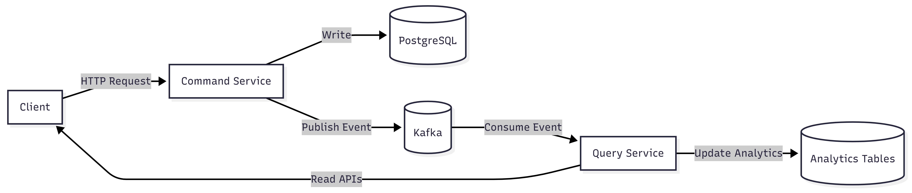

# CQRS Kafka Analytics System

## Overview

This project demonstrates a real-time event-driven microservices architecture using the CQRS (Command Query Responsibility Segregation) pattern with Apache Kafka and PostgreSQL.

The system separates write operations (Command Service) from read/analytics operations (Query Service) and processes data asynchronously using Kafka.

---

## Architecture

```
Client → Command Service → PostgreSQL
                      ↓
                   Kafka
                      ↓
                Query Service → Analytics DB Tables
```

### Flow

1. User sends request to Command Service  
2. Data is stored in PostgreSQL  
3. Event is published to Kafka  
4. Query Service consumes event  
5. Analytics tables are updated in real-time  

---

## Tech Stack

| Technology              | Purpose          |
| ----------------------- | ---------------- |
| Node.js + Express       | Backend APIs     |
| PostgreSQL              | Database         |
| Apache Kafka            | Event streaming  |
| KafkaJS                 | Kafka client     |
| Docker & Docker Compose | Containerization |
| Jest + Supertest        | Testing          |

---

## Project Structure

```
cqrs-kafka-analytics/
│
├── command-service/        # Handles write operations
├── query-service/          # Handles analytics (read side)
├── tests/                  # API test cases
├── seeds/                  # DB initialization scripts
├── docker-compose.yml      # Multi-container setup
├── .env                    # Environment variables
├── .env.example            # Sample env config
└── README.md
```

---
## 📊 Architecture Diagrams

### System Architecture



## Environment Variables

### `.env.example`

```env
# PostgreSQL
DB_HOST=db
DB_PORT=5432
POSTGRES_DB=analytics_db
POSTGRES_USER=user
POSTGRES_PASSWORD=password

# Kafka
KAFKA_BROKER=kafka:9092

# Topics
PRODUCT_TOPIC=product-events
ORDER_TOPIC=order-events

# App Ports
COMMAND_SERVICE_PORT=8080
QUERY_SERVICE_PORT=8081

# Consumer Group
KAFKA_GROUP_ID=query-service-group
```

---

## Running the Project (Docker)

### Step 1: Start all services

```bash
docker-compose up --build
```

---

### Step 2: Verify services

```bash
curl http://localhost:8080/health
curl http://localhost:8081/health
```

---

## API Endpoints

### Command Service (Write APIs)

#### Create Product

```bash
curl -X POST http://localhost:8080/api/products \
-H "Content-Type: application/json" \
-d '{"name":"Phone","category":"electronics","price":500}'
```

---

#### Create Order

```bash
curl -X POST http://localhost:8080/api/orders \
-H "Content-Type: application/json" \
-d '{"customerId":1,"items":[{"productId":1,"quantity":2,"price":500}]}'
```

---

### Query Service (Analytics APIs)

#### Product Sales

```bash
curl http://localhost:8081/api/analytics/product-sales
```

---

#### Category Revenue

```bash
curl http://localhost:8081/api/analytics/category-revenue
```

---

#### Hourly Sales

```bash
curl http://localhost:8081/api/analytics/hourly-sales
```

---

## Database Schema

### Core Tables

* products  
* orders  

### Analytics Tables

* product_sales  
* category_revenue  
* hourly_sales  

---

## Event Processing

When an order is created:

* Event is sent to Kafka (order-events)  
* Query Service consumes event  
* Updates:  
  * Product-wise sales  
  * Category-wise revenue  
  * Hourly aggregation  

---

## Testing

### Install dependencies

```bash
npm install
```

---

### Run tests

```bash
npm test
```

### Tests cover:

* Health endpoints  
* Product creation  
* Order creation  
* Analytics APIs  

---

## Kafka Verification

```bash
docker exec -it kafka kafka-topics --bootstrap-server localhost:9092 --list
```

---

## Database Verification

```bash
docker exec -it cqrs_db psql -U user -d analytics_db
```

```sql
SELECT * FROM product_sales;
SELECT * FROM category_revenue;
SELECT * FROM hourly_sales;
```

---

## Features Implemented

* CQRS architecture  
* Event-driven communication using Kafka  
* Microservices design  
* Real-time analytics processing  
* Dockerized setup  
* Retry handling for Kafka  
* Health check APIs  
* Testing using Jest & Supertest  
* Environment-based configuration  

---

## Real-World Use Cases

This architecture is widely used in:

* E-commerce platforms (Amazon, Flipkart)  
* Food delivery apps (Swiggy, Zomato)  
* Banking systems  
* Real-time dashboards  

---

## Key Benefits

* Loose coupling between services  
* Scalable architecture  
* Real-time analytics  
* Fault tolerance with Kafka  

---

## Demo

Demo Video Link:  
https://drive.google.com/file/d/1o0939_Umfka4Ilp5jAnoCPLKHgnUYDAj/view?usp=sharing

---